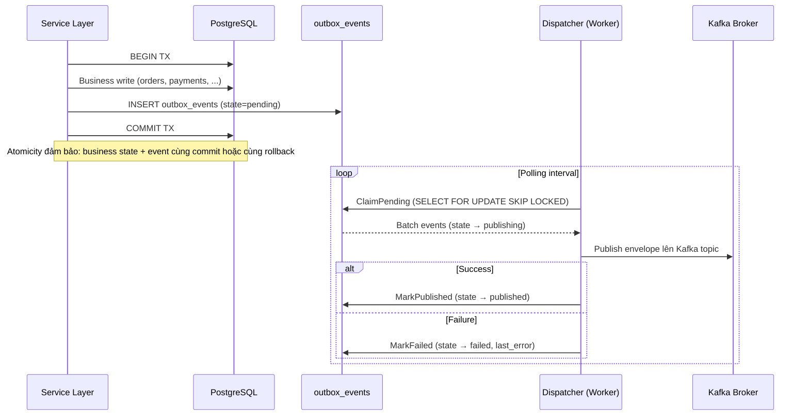
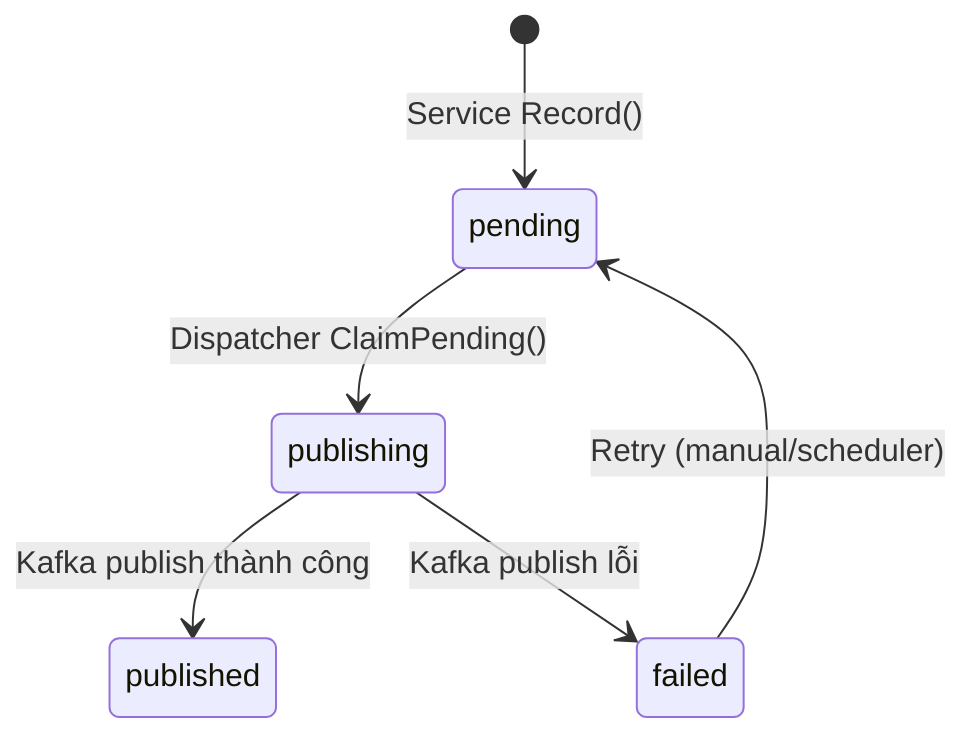

# Platform Outbox — Tài liệu Kiến trúc & Triển khai

## 1. Tổng quan

`internal/platform/outbox` triển khai **Transactional Outbox Pattern** theo đúng spec được định nghĩa tại:
- [kafka_spec.md](file:///home/duclm/Downloads/Backend/bookstore-golang/docs/specs/kafka_spec.md) — Mục 4 (Outbox pattern bắt buộc)
- [2.erd_specs.md](file:///home/duclm/Downloads/Backend/bookstore-golang/docs/specs/2.erd_specs.md) — Mục 6.9.3 (Bảng `outbox_events`)
- [1.srd_specs.md](file:///home/duclm/Downloads/Backend/bookstore-golang/docs/specs/1.srd_specs.md) — Mục 14.4 (Kafka processing rules)

> [!IMPORTANT]
> **Quy tắc vàng**: Mọi domain event và command event phát từ transaction nghiệp vụ **phải** đi qua outbox pattern. Không được publish trực tiếp từ HTTP handler hoặc service transaction sang Kafka broker rồi mới commit DB.

---

## 2. Flow hoạt động



---

## 3. Cấu trúc file

| File | Chức năng |
|---|---|
| [model.go](file:///home/duclm/Downloads/Backend/bookstore-golang/internal/platform/outbox/model.go) | Định nghĩa `OutboxEvent` struct và `State` constants |
| [envelope.go](file:///home/duclm/Downloads/Backend/bookstore-golang/internal/platform/outbox/envelope.go) | Cấu trúc Kafka envelope chuẩn (lưu trong `payload` JSONB) |
| [recorder.go](file:///home/duclm/Downloads/Backend/bookstore-golang/internal/platform/outbox/recorder.go) | DTO `RecordParams` — input cho Recorder |
| [repository.go](file:///home/duclm/Downloads/Backend/bookstore-golang/internal/platform/outbox/repository.go) | Interface definitions: `Repository`, `Publisher`, `Recorder`, `Dispatcher` |
| [postgres_repository.go](file:///home/duclm/Downloads/Backend/bookstore-golang/internal/platform/outbox/postgres_repository.go) | PostgreSQL implementation với `tx.GetExecutor` pattern |
| [service.go](file:///home/duclm/Downloads/Backend/bookstore-golang/internal/platform/outbox/service.go) | `OutboxRecorder` — ghi event vào outbox trong transaction |
| [publisher.go](file:///home/duclm/Downloads/Backend/bookstore-golang/internal/platform/outbox/publisher.go) | `KafkaPublisher` — adapter từ outbox → `kafka.Producer` |
| [dispatcher.go](file:///home/duclm/Downloads/Backend/bookstore-golang/internal/platform/outbox/dispatcher.go) | `OutboxDispatcher` — polling worker claim + publish + mark |
| [errors.go](file:///home/duclm/Downloads/Backend/bookstore-golang/internal/platform/outbox/errors.go) | Sentinel errors |
| [provider.go](file:///home/duclm/Downloads/Backend/bookstore-golang/internal/platform/outbox/provider.go) | Wire `ProviderSet` cho dependency injection |

---

## 4. Outbox State Machine

Theo spec Mục 4.3 của `kafka_spec.md`:



> [!NOTE]
> Spec định nghĩa thêm state `parked` (lỗi cần can thiệp tay). State này chưa triển khai ở phase 1, có thể thêm sau khi cần thiết bằng cách mở rộng migration `CHECK` constraint.

---

## 5. Chi tiết các component

### 5.1 OutboxRecorder (Write Path)

**Vai trò**: Được service layer gọi **bên trong** `tx.WithinTransaction()` để ghi event cùng transaction nghiệp vụ.

**Cơ chế**:
1. Nhận `RecordParams` (topic, event_type, aggregate info, payload, trace context)
2. Sinh UUID cho `event_id` (dùng `google/uuid`)
3. Build `Envelope` chuẩn spec 5.1 (event_id, event_type, aggregate_type, occurred_at, trace/correlation/causation IDs)
4. Marshal envelope → JSON → lưu vào cột `payload` JSONB
5. Tách trace context → lưu vào cột `metadata` JSONB (hỗ trợ query/debug mà không cần parse payload)
6. Insert vào `outbox_events` với `state = 'pending'`

```go
// Ví dụ sử dụng trong Order service
err := txManager.WithinTransaction(ctx, func(ctx context.Context) error {
    // 1. Business write
    if err := orderRepo.Create(ctx, order); err != nil {
        return err
    }
    // 2. Outbox record (cùng transaction)
    aggID := strconv.FormatInt(order.ID, 10)
    return recorder.Record(ctx, outbox.RecordParams{
        Topic:         string(kafka.TopicOrderEvents),
        EventKey:      "order:" + aggID,
        AggregateType: "order",
        AggregateID:   &aggID,
        EventType:     "order.created",
        OccurredAt:    time.Now(),
        SchemaVersion: 1,
        Payload: map[string]any{
            "order_id": order.ID,
            "user_id":  order.UserID,
            // ...
        },
    })
})
```

### 5.2 PostgresRepository

**Vai trò**: Data access layer cho bảng `outbox_events`.

**Đặc điểm quan trọng**:
- Sử dụng `tx.GetExecutor(ctx, pool)` — tự động dùng `pgx.Tx` nếu đang trong transaction, fallback về pool nếu không
- `ClaimPending` dùng `SELECT FOR UPDATE SKIP LOCKED` để hỗ trợ **multiple worker instances** chạy song song mà không bị deadlock
- `MarkPublished` set `published_at = NOW()` khi thành công
- `MarkFailed` lưu error message vào `last_error` để debug

### 5.3 KafkaPublisher

**Vai trò**: Bridge giữa outbox layer và kafka layer.

**Cơ chế**:
1. Unmarshal `outbox.Envelope` từ payload JSON
2. Convert types: `*string` AggregateID → `string`, `*int64` ActorID → `int64`
3. Build `kafka.Envelope` (chuẩn spec 5.1) với `ProducedAt = time.Now()` (thời điểm thực sự publish)
4. Bảo toàn EventID gốc (đã sinh 1 lần duy nhất khi Record)
5. Forward observability fields (trace_id, correlation_id, causation_id)
6. Delegate cho `kafka.Producer.PublishEnvelope()`

### 5.4 OutboxDispatcher (Read Path)

**Vai trò**: Worker polling loop, được gọi theo interval bởi scheduler/worker app.

**Cơ chế `DispatchOnce(ctx, limit)`**:
1. `ClaimPending(limit)` — claim batch events (state: pending → publishing)
2. Iterate từng event:
   - Gọi `Publisher.Publish()` → Kafka
   - Thành công → `MarkPublished()`
   - Thất bại → `MarkFailed()` + log error
3. Trả về count published
4. Error trên 1 event **không** block các event khác trong batch

---

## 6. Database Schema

Aligned với migration `000007_create_outbox_event.up.sql`:

```sql
CREATE TABLE IF NOT EXISTS outbox_events (
    id BIGSERIAL PRIMARY KEY,
    topic VARCHAR(100) NOT NULL,
    event_key VARCHAR(255) NOT NULL,
    aggregate_type VARCHAR(50) NOT NULL,
    aggregate_id VARCHAR(255),
    event_type VARCHAR(100) NOT NULL,
    payload JSONB NOT NULL,
    metadata JSONB,
    state VARCHAR(30) NOT NULL DEFAULT 'pending',
    created_at TIMESTAMPTZ NOT NULL DEFAULT NOW(),
    published_at TIMESTAMPTZ,
    last_error TEXT,
    CHECK (state IN ('pending', 'published', 'failed'))
);

CREATE INDEX idx_outbox_events_state_created_at
    ON outbox_events (state, created_at);
```

> [!TIP]
> `aggregate_id` dùng `VARCHAR(255)` thay vì `BIGINT` (khác với ERD spec) để hỗ trợ cả UUID-based keys trong tương lai.

---

## 7. Wire Integration

`outbox.ProviderSet` export sẵn cho bootstrap:

```go
var ProviderSet = wire.NewSet(
    ProvideRepository,
    ProvideRecorder,
    ProvidePublisher,
    ProvideDispatcher,
    wire.Bind(new(Repository), new(*PostgresRepository)),
    wire.Bind(new(Recorder), new(*OutboxRecorder)),
    wire.Bind(new(Publisher), new(*KafkaPublisher)),
    wire.Bind(new(Dispatcher), new(*OutboxDispatcher)),
)
```

**Dependencies**:
- `*pgxpool.Pool` — từ `PlatformSet`
- `*kafka.Producer` — từ `kafka.ProviderSet`
- `*zap.Logger` — từ `PlatformSet`

---

## 8. Tại sao thiết kế như vậy?

| Quyết định | Lý do |
|---|---|
| Flat package (không sub-package `postgres/`) | Tránh import cycle, consistent với pattern `idempotency` package |
| `tx.GetExecutor()` trong repository | Insert outbox cùng transaction nghiệp vụ — **đây là toàn bộ ý nghĩa của outbox pattern** |
| `SELECT FOR UPDATE SKIP LOCKED` | Cho phép nhiều dispatcher instances chạy song song an toàn |
| Tách Recorder vs Dispatcher | Recorder = write path (trong tx), Dispatcher = read path (worker loop) — separation of concerns |
| Metadata JSONB riêng biệt | Query/filter theo trace_id mà không cần parse payload JSONB nặng |
| Envelope serialize 2 lần | Recorder marshal envelope → payload JSONB. Publisher unmarshal → rebuild kafka.Envelope. Trade-off: đơn giản hơn shared struct, dễ evolve schema riêng |
