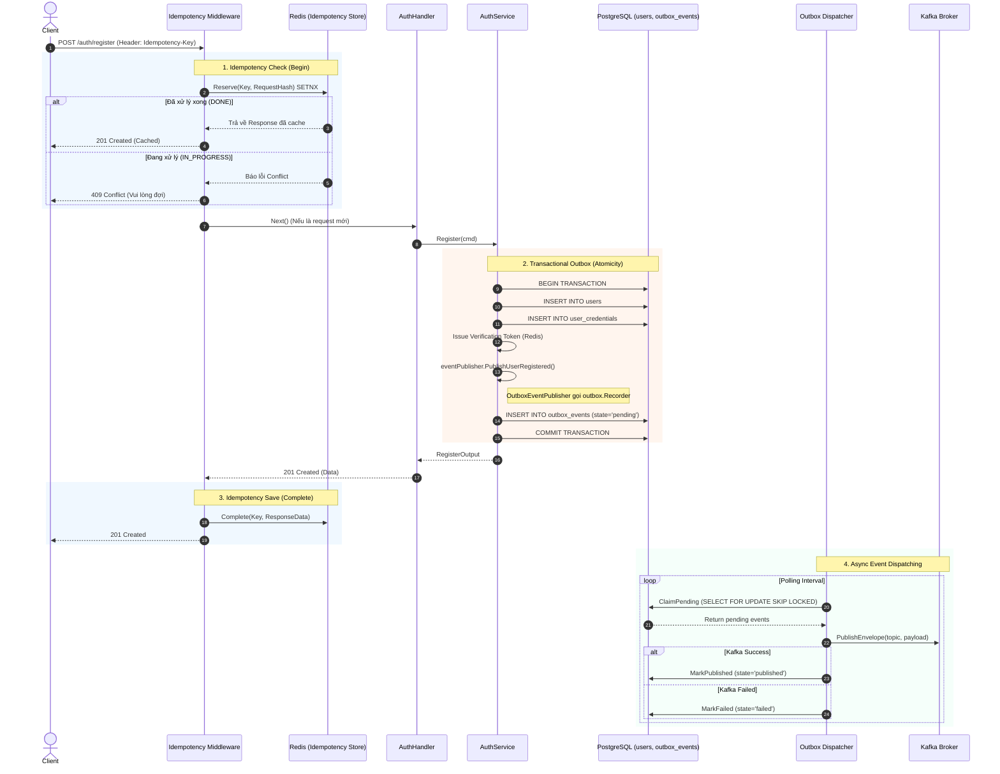

# Kiến trúc Luồng Đăng ký (Register Flow) kết hợp Identity & Core Platforms

Tài liệu này giải thích chi tiết quá trình xử lý một request đăng ký người dùng mới (`POST /api/v1/auth/register`), minh họa cách module **Identity** phối hợp với các platform hạ tầng: **Idempotency** (Redis), **Transactional Outbox** (PostgreSQL), và **Kafka**.

---

## 1. Sequence Diagram Tổng Quan

Sơ đồ dưới đây trình bày luồng đi của dữ liệu, từ Middleware cho đến Background Worker:

---

## 2. Giải thích Chi tiết các Giai đoạn

### Giai đoạn 1: Idempotency Check (Chống trùng lặp Request)
Khi Client gửi request đăng ký kèm theo header `Idempotency-Key`, `idempotency.GinMiddleware` sẽ chặn lại ở cửa ngõ:
1. Middleware băm (hash) phần body của request để tạo `RequestHash`.
2. Gọi Redis để xin cấp khóa (Reserve) bằng lệnh atomic `SETNX`.
   - Nếu `SETNX` thất bại và trạng thái là `IN_PROGRESS`: Có một request tương tự đang được xử lý, trả về lỗi `409 Conflict`.
   - Nếu trạng thái là `DONE`: Request này đã từng thành công trước đó, Middleware lấy trực tiếp HTTP Response (Status, Headers, Body) từ Redis và trả thẳng về cho Client. Hệ thống backend hoàn toàn không phải chạy lại logic.
   - Nếu là khóa mới: Redis thiết lập trạng thái `IN_PROGRESS` và cho phép request đi tiếp (`c.Next()`).

### Giai đoạn 2: Business Logic & Transactional Outbox
Request đi vào `AuthService.Register`:
1. Mở một **Database Transaction** (`txManager.WithinTransaction`).
2. Insert dữ liệu người dùng vào các bảng `users` và `user_credentials`.
3. Sinh mã xác thực email (Verification Token).
4. Thay vì bắn thẳng event lên Kafka (rất rủi ro nếu hệ thống sập ngay sau đó), Service gọi `OutboxEventPublisher` (một adapter implement port `EventPublisher`).
5. `OutboxEventPublisher` đóng gói dữ liệu thành chuẩn `kafka.Envelope`, gọi `outbox.Recorder` để **INSERT** một bản ghi vào bảng `outbox_events` với trạng thái `pending`.
6. Toàn bộ thao tác trên nằm chung một Transaction. Khi lệnh **COMMIT** được gọi, cả dữ liệu người dùng và event thông báo đều được lưu xuống đĩa một cách an toàn (Nguyên tắc Atomicity).

### Giai đoạn 3: Idempotency Complete
Sau khi `AuthHandler` trả về mã `201 Created`, Middleware tiếp tục can thiệp:
1. Đọc nội dung HTTP Response.
2. Cập nhật lại bản ghi Idempotency trên Redis thành trạng thái `DONE`, lưu trữ toàn bộ Response Body và Headers kèm theo TTL (ví dụ 24h).
3. Đóng kết nối HTTP với Client.

### Giai đoạn 4: Async Event Dispatching (Worker)
Một Background Process (Worker/Scheduler) chạy ngầm độc lập với luồng API:
1. `OutboxDispatcher` liên tục quét bảng `outbox_events` để tìm các event đang ở trạng thái `pending`.
2. Sử dụng câu lệnh `SELECT FOR UPDATE SKIP LOCKED`, đảm bảo dù có chạy nhiều con Worker cùng lúc thì cũng không bị giành giật dữ liệu hay Deadlock.
3. Chuyển state sang `publishing` và thực hiện bắn event sang **Kafka Broker** thông qua `KafkaPublisher`.
4. Dựa vào kết quả (Ack) từ Kafka:
   - Nếu thành công: Cập nhật state thành `published` (`MarkPublished`).
   - Nếu thất bại: Cập nhật state thành `failed` kèm theo lỗi (`MarkFailed`), chờ cron job quét lại sau.

---

## 3. Tại sao kiến trúc này tối ưu?

1. **Tính Nhất quán Tuyệt đối (Consistency):** Khắc phục triệt để lỗi "DB đã lưu user nhưng Kafka sập nên không gửi được email xác nhận". Event luôn luôn được gửi đi miễn là User được tạo thành công trong DB.
2. **Khả năng chịu lỗi (Resilience):** Dù Kafka Broker đang downtime, API đăng ký vẫn hoạt động bình thường siêu tốc độ (vì chỉ insert vào Postgres). Khi Kafka hoạt động lại, Worker sẽ tiếp tục quá trình đẩy event.
3. **Chống trùng lặp (Idempotency):** Người dùng có bấm "Đăng ký" liên tục 10 lần thì hệ thống chỉ tạo đúng 1 user và bắn đúng 1 event, 9 lần sau sẽ nhận kết quả cache cực nhẹ.
4. **Decoupling (Kiến trúc rời rạc):** `AuthService` hoàn toàn không quan tâm đến Kafka hay Redis, nó chỉ làm việc với các interface (Ports) thuần túy. Phần tích hợp nặng nề đã được đẩy ra ngoài vòng Adapter.
